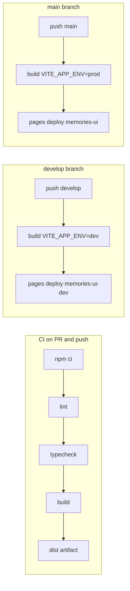

# Deployment (Cloudflare Pages + GitHub Actions)

Memories UI ships as a static SPA. **Develop** and **production** each have their own Cloudflare Pages project and GitHub Environment.

## URLs

| Environment | Branch | Cloudflare project (default) | URL |
|-------------|--------|------------------------------|-----|
| Dev | `develop` | `memories-ui-dev` | https://memories-ui-dev.pages.dev |
| Production | `main` | `memories-ui` | https://memories-ui.pages.dev |

Project names can be overridden with repository **Variables** (see below).

## One-time setup (Jay)

### 1. Cloudflare (free)

1. Create a [Cloudflare](https://dash.cloudflare.com/sign-up) account.
2. Note your **Account ID** (Workers & Pages → overview, right column).
3. Create an **API token**:
   - My Profile → API Tokens → Create Token → **Custom token**
   - Permission: **Account** → **Cloudflare Pages** → **Edit**
   - Account resources: include this account
4. Pages projects:
   - Either create two projects in the dashboard (**memories-ui-dev**, **memories-ui**), or let the first `wrangler pages deploy` create them when the workflow runs.

SPA routing: `public/_redirects` is copied into `dist/` on build (`/* /index.html 200`). No extra Cloudflare config required.

### 2. GitHub repository (`jaykhare1313/memories-ui`)

After mirroring/pushing this repo:

**Secrets** (Settings → Secrets and variables → Actions → Secrets):

| Secret | Value |
|--------|--------|
| `CLOUDFLARE_API_TOKEN` | Token from step 3 above |
| `CLOUDFLARE_ACCOUNT_ID` | Cloudflare account ID |

**Variables** (optional; defaults match this repo):

| Variable | Default | Purpose |
|----------|---------|---------|
| `CF_PAGES_PROJECT_DEV` | `memories-ui-dev` | Dev Pages project name |
| `CF_PAGES_PROJECT_PROD` | `memories-ui` | Prod Pages project name |

**Environments** (Settings → Environments):

1. **`dev`** — used when deploying from `develop`.
2. **`production`** — used when deploying from `main`.

Optional: on **`production`**, add **Required reviewers** so prod deploys need approval.  
**Note:** Environment protection rules (required reviewers, wait timers) on **private** repositories require a paid GitHub plan. Public repos can use reviewers on free plans.

### 3. Branches

- `main` → production deploys  
- `develop` → dev deploys (create from `main` if missing)

## CI/CD flow



### Promotion workflow

1. Feature branch → **PR into `develop`** → CI runs on the PR.
2. Merge to **`develop`** → CI runs again + **Deploy** pushes to **memories-ui-dev** (DEV badge visible).
3. **PR `develop` → `main`** → CI on the PR.
4. Merge to **`main`** → CI + **Deploy** pushes to **memories-ui** (no DEV badge).

Manual prod/dev deploy: Actions → **Deploy** → **Run workflow** (choose `main` or `develop`).

Concurrency: one deploy at a time per environment (`cloudflare-pages-dev` / `cloudflare-pages-production`); newer runs cancel in-progress deploys.

## Build-time env (deploy workflows)

| Variable | Dev | Prod |
|----------|-----|------|
| `VITE_DATA_SOURCE` | `mock` | `mock` |
| `VITE_APP_ENV` | `dev` | `prod` |

Switch to a real API later by setting `VITE_DATA_SOURCE=api` and `VITE_API_BASE_URL` in the workflow build step.

## Rollback

1. Open [Cloudflare Pages](https://dash.cloudflare.com/) → select the project → **Deployments**.
2. Find a previous successful deployment → **Rollback to this deployment** (or **Promote to production**).

Git revert + push to `develop` or `main` is also fine; that triggers a new deploy from the older commit.

## Local parity

```bash
npm ci
npm run lint
npm run typecheck
VITE_DATA_SOURCE=mock VITE_APP_ENV=dev npm run build
```

Preview: `npm run preview`
