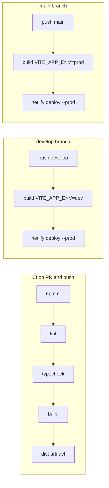

# Deployment (Netlify + GitHub Actions)

Memories UI ships as a static SPA. **Develop** and **production** each have their own Netlify site and GitHub Environment. **GitHub Actions** builds `dist/` and deploys with the Netlify CLI—Netlify’s connected-repo auto-builds should stay **off** so Actions remains the only deploy path.

## URLs

| Environment | Branch | Site name (target) | Typical URL |
|-------------|--------|--------------------|-------------|
| Dev | `develop` | `memories-ui-dev` | https://memories-ui-dev.netlify.app |
| Production | `main` | `memories-ui` | https://memories-ui.netlify.app |

Netlify site names must be **globally unique**. If a name is taken, pick another (e.g. `memories-ui-dev-jay`) and use that site’s URL—the **Site ID** in GitHub secrets is what the workflow uses, not the subdomain string.

## One-time setup (Jay)

### 1. Netlify (free)

1. Sign up at [netlify.com](https://www.netlify.com/).
2. Create **two sites** (no need to connect Git yet):
   - **Option A — Dashboard:** Add new site → **Deploy manually** (drag-and-drop any folder once, or skip after site creation).
   - **Option B — CLI:** `npm i -g netlify-cli && netlify login`, then  
     `netlify sites:create --name memories-ui-dev` and `netlify sites:create --name memories-ui`.
3. For each site, open **Site configuration → General → Site details** and copy the **Site ID** (API ID).
4. **Disable Netlify Git builds** (so only GitHub Actions deploys):
   - If you linked a repo: **Build & deploy → Continuous deployment → Stop builds** (or unlink the repo).
   - For manual sites: leave **Build settings** empty; no build command or publish directory on Netlify.
5. Create a **Personal access token**: User settings → **Applications** → **Personal access tokens** → New token (deploy scope is sufficient).

SPA routing: `netlify.toml` and `public/_redirects` (`/* /index.html 200`) are copied into `dist/` on build.

### 2. GitHub repository (`jaykhare1313/memories-ui`)

**Secrets** (Settings → Secrets and variables → Actions → Secrets):

| Secret | Value |
|--------|--------|
| `NETLIFY_AUTH_TOKEN` | Netlify personal access token |
| `NETLIFY_SITE_ID_DEV` | Site ID for the dev site |
| `NETLIFY_SITE_ID_PROD` | Site ID for the production site |

**Environments** (Settings → Environments):

1. **`dev`** — deploys from `develop`.
2. **`production`** — deploys from `main`.

Optional: on **`production`**, add **Required reviewers** for deploy approval.  
**Note:** Environment protection rules on **private** repositories require a paid GitHub plan. Public repos can use reviewers on free plans.

### 3. Branches

- `main` → production deploys  
- `develop` → dev deploys  

## CI/CD flow



### Promotion workflow

1. Feature branch → **PR into `develop`** → CI runs.
2. Merge to **`develop`** → CI + **Deploy** → dev Netlify site (**DEV** badge in the app bar).
3. **PR `develop` → `main`** → CI.
4. Merge to **`main`** → CI + **Deploy** → production Netlify site.

Manual deploy: Actions → **Deploy** → **Run workflow** on `develop` or `main`.

Concurrency: one deploy at a time per environment (`netlify-dev` / `netlify-production`); newer runs cancel in-progress deploys.

## Build-time env (deploy workflows)

| Variable | Dev | Prod |
|----------|-----|------|
| `VITE_DATA_SOURCE` | `mock` | `mock` |
| `VITE_APP_ENV` | `dev` | `prod` |

## Rollback

1. Open [Netlify](https://app.netlify.com/) → select the site → **Deploys**.
2. Find a previous successful production deploy → **Publish deploy** (or **Restore**).

Alternatively, git revert on `develop` or `main` and push to trigger a new deploy from that commit.

## Local parity

```bash
npm ci
npm run lint
npm run typecheck
VITE_DATA_SOURCE=mock VITE_APP_ENV=dev npm run build
```

Optional manual Netlify deploy (after `netlify login`):

```bash
NETLIFY_AUTH_TOKEN=... npx netlify-cli deploy --dir=dist --prod --site=YOUR_SITE_ID
```

Preview locally: `npm run preview`
